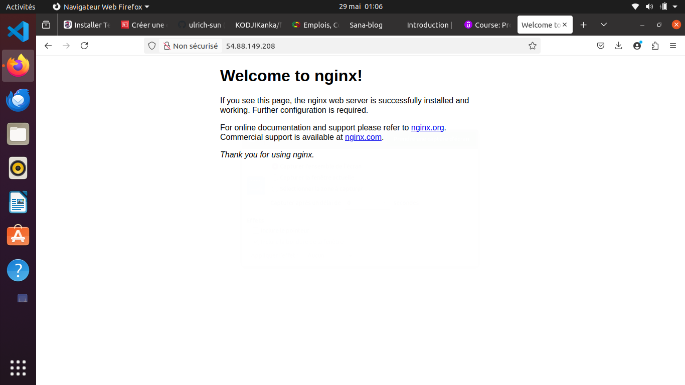

# Mini-projet Terraform — Déploiement d'une infrastructure AWS complète

## Contexte
Ce projet est une implémentation Terraform d'une infrastructure AWS modulaire.
L'objectif est de déployer une instance EC2 Ubuntu avec un volume EBS, une IP publique élastique et une security group adaptée, puis d'exporter la metadata de connexion dans un fichier texte.

## Architecture du projet
- `app/` : configuration Terraform principale qui utilise les modules.
- `modules/ec2/` : module EC2 avec génération de clé SSH, provisionnement d'une instance Ubuntu et exécution d'un script d'installation.
- `modules/ebs/` : module EBS pour créer un volume attachable.
- `modules/eip/` : module d'allocation d'une IP publique élastique.
- `modules/securitygroup/` : module de security group autorisant les ports 80, 443 et 22.
- `app/files/install.sh` : script de provisionnement qui installe NGINX sur l'instance.
- `app/ip_address.txt` : fichier de sortie contenant l'adresse IP publique de l'EC2.
- `nginx_terraform.png` : capture d'écran montrant NGINX accessible.

## Modules Terraform
### `modules/ec2`
- Crée une instance AWS EC2.
- Utilise une AMI Ubuntu récente (`ubuntu-focal-20.04-amd64-server-*`).
- Génère une paire de clés TLS/AWS pour l'accès SSH.
- Attache la security group fournie.
- Provisionne NGINX via `remote-exec` et le script `app/files/install.sh`.
- Paramètres principaux : `ami`, `instance_type`, `availability_zone`, `security_group_name`, `tag_name`, `user`, `key_name`.

### `modules/ebs`
- Crée un volume EBS variable.
- Paramètres : `ebs_size`, `ebs_zone`, `ebs_tags`.
- Expose : `ebs_id`, `ebs_zone`.

### `modules/eip`
- Crée une IP Elastic publique.
- Paramètre : `eip_name`.
- Expose : `eip_id`.
- Génère `ip_address.txt` contenant l'adresse IP publique.

### `modules/securitygroup`
- Crée une security group AWS.
- Ouvre les ports TCP 80, 443 et 22 pour tout le monde.
- Paramètre : `security_group_name`.
- Expose : `name`.

## Déploiement
1. Aller dans le dossier principal de l'application :
   ```bash
   cd app
   ```
2. Initialiser Terraform :
   ```bash
   terraform init
   ```
3. Appliquer la configuration :
   ```bash
   terraform apply
   ```
   - Accepter la proposition avec `yes`.
4. Après déploiement, vérifier le fichier d'IP :
   ```bash
   cat ip_address.txt
   ```
5. Pour détruire l'infrastructure :
   ```bash
   terraform destroy
   ```

## Variables
- `instance_type` est défini dans `app/terraform.tfvars` comme `t3.small`.
- Le provider AWS est configuré dans `app/provider.tf` pour la région `us-east-1`.

## Résultats attendus
- Une instance EC2 Ubuntu configurée avec NGINX.
- Un volume EBS attaché à l'instance.
- Une IP publique Elastic associée à l'instance.
- Une security group ouverte sur les ports 80 et 443.
- Export de l'adresse publique dans `app/ip_address.txt`.

## Capture d'écran


## Remarques
- Le projet respecte la modularité en séparant chaque composant AWS dans un module dédié.
- Le script `app/files/install.sh` installe NGINX automatiquement sur l'instance après le provisioning.
- La capture de l'accès NGINX est disponible dans `nginx_terraform.png`.

---

## 👤 Auteur

**KODJI Kanka**  
Formation DevOps — [EazyTraining](https://eazytraining.fr)  
GitHub : [KODJIKanka](https://github.com/KODJIKanka)

---

## 📄 Licence

Ce projet est réalisé dans le cadre d'une formation DevOps avec EazyTraining.
